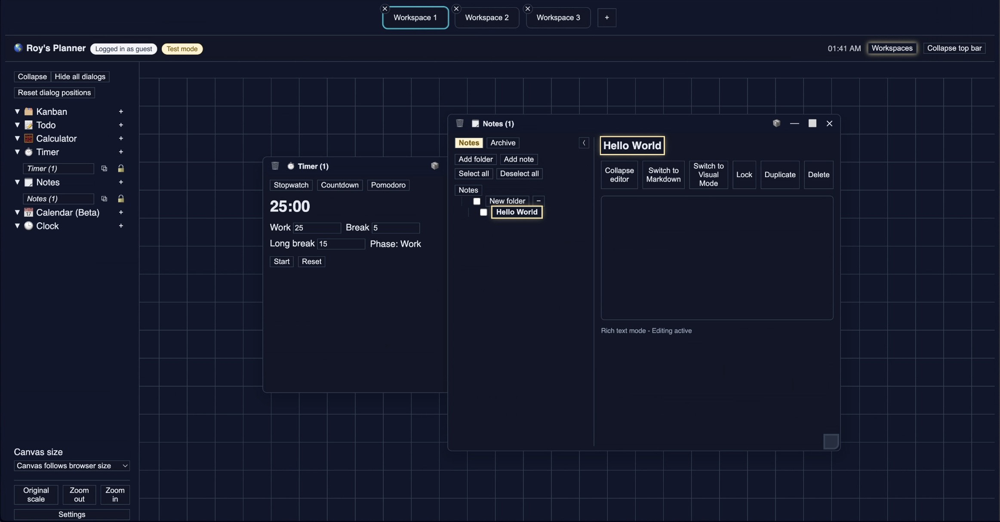

# Operator App



Operator App is an OS-like, browser-first experiment for running multiple lightweight apps
(todos, notes, kanban, timers, etc.) inside movable dialogs with workspaces.

The app supports:

- guest/local mode (`localStorage`, no cloud writes)
- authenticated cloud mode (Cognito + remote storage API)
- realtime invalidation (WebSocket) with polling fallback
- LLM residents (beta): credential references, universe policy, resident roster, pencil lease, and action log

All persistence goes through an async storage adapter, so backend storage is pluggable.

## Quick start

```bash
cd frontend
npm install
npm run start
```

## Guest-only mode

Guest-only mode hides the login form and allows only guest access.

To enable guest-only mode:

1. Update `frontend/package.json`:

```json
"guestModeOnly": true
```

2. Update `frontend/src/assets/op-config.js`:

```js
guestModeOnly: true;
```

## Test mode and persistence

- Guests always use local storage (test mode), even when cloud auth/storage is enabled.
- Authenticated users can also be forced into local test mode via org settings.

Persistence flows through `StorageService` and the `StorageAdapter` interface. Hydration runs in
`APP_INITIALIZER`, so the UI does not read persisted state until storage is ready.

To use remote storage:

- Set `storageMode: 'remote'` and `storageApiBaseUrl` in `frontend/src/assets/op-config.js`
- Configure an auth provider (Cognito is implemented)

### Remote storage endpoints

The built-in remote adapter expects these endpoints:

- `GET {base}/storage/keys` -> `{ keys: string[] }`
- `GET {base}/storage/item?key=...` -> `{ value: string | null, version?: number, updatedAt?: number }`
- `PUT {base}/storage/item` with body `{ key, value, version }`
- `DELETE {base}/storage/item?key=...`
- `POST {base}/storage/batchGet` with body `{ keys }`

The remote adapter uses optimistic concurrency (`version`) and handles `409` conflicts.

## Realtime sync

Realtime sync uses WebSocket invalidation when available and polling fallback when not.

- WebSocket failures should not block app usage.
- App-instance persistence uses debounce/coalescing and `409`/`429` handling to reduce thrash.

## LLM residents (beta)

LLM residents are intentionally guarded:

- disabled in guest mode
- disabled when org test mode is enabled
- metadata-only credential references are persisted; secret key material is session-scoped by default
- policy + resident changes require universe invite/admin permissions
- actions are rate-limited and audit logged with payload redaction

Current settings surfaces:

- `Settings > Credentials`: LLM credential references + session secret assignment
- `Settings > Multi-user`: LLM policy, resident roster, pencil lease controls, action log viewer

## Docs

- `Docs/conventions.md` - coding, styling, unit/e2e, and security coding conventions
- `Docs/aws-setup.md` - current AWS resources and deployment notes
- `Docs/backend-setup.md` - provider-agnostic backend contract
- `Docs/observability-runbook.md` - correlation IDs, alert taxonomy, and incident triage flow
- `Docs/compliance-prep.md` - data classification, retention, and access-control prep artifacts
- `Docs/qa-matrix.md` - pre-launch scenario matrix and evidence worksheet
- `Docs/release-checklist.md` - pre-launch matrix and ship checklist
- `Docs/security-pass-2026-03-04.md` - latest security audit and hardening summary
- `Docs/llm-spec-delta-2026-03-04.md` - LLM resident scope/status against spec

## License

MIT. See `LICENSE`.
